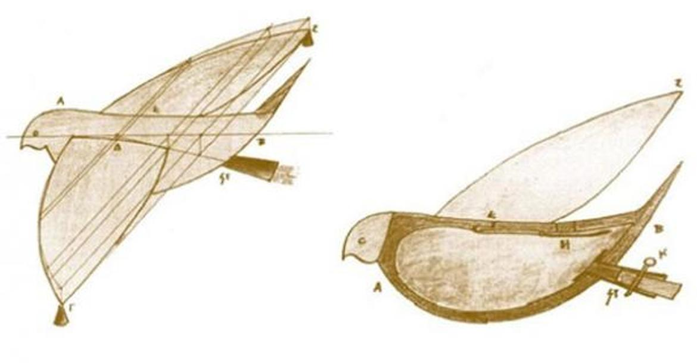
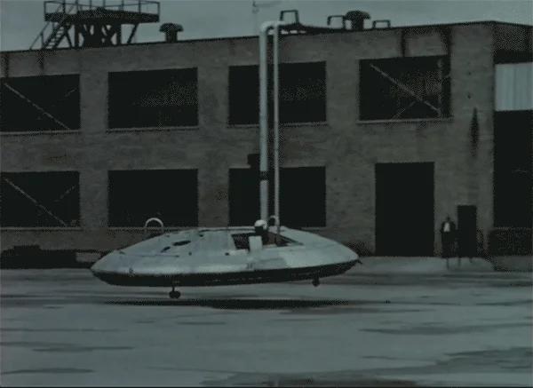
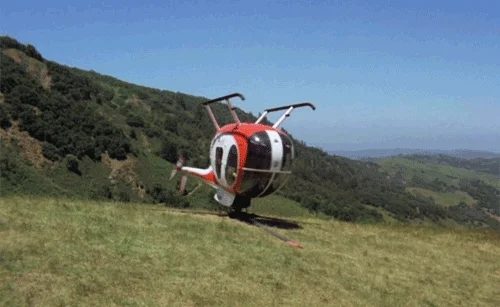
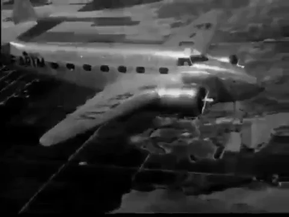

# :crossed_swords: Il sogno di volare #

## Introducción ##

La historia de la aviación se remonta al día en el que el hombre prehistórico se paró a observar el vuelo de las aves y de otros animales voladores.



Se sabe que alrededor del año 400 a. C., Arquitas de Tarento, un estudioso de la Antigua Grecia, construyó un artefacto de madera que él mismo bautizó con el nombre de "Peristera" (en griego: Περιστέρα, "Paloma"), que tenía forma de ave y era capaz de volar a unos 180 metros de altura.



Todo ha cambiado desde entonces, y hoy en día somos capaces de volar con facilidad y sentir tan magna experiencia.


Harás un homenaje al "sueño de volar" que tanto ha acompañado a la humanidad en forma de galería de fotografías.

Te proveemos de un código base que habrás de ir rellenando y una carpeta `assets`, donde podrás encontrar las imágenes a utilizar. Hay fotos de aviones y helicópteros, tanto civiles como militares.


## Requisitos ##

- Conocimientos previos:

    - Precurso Web

    - Javascript orientado a objetos.

- No habrás de escribir absolutamente nada en HTML. Todo habrá de hacerse mediante Javascript.



## Iteraciones ##

Existen 2 clases y varios "arrays": Gallery, Painter y 4 "arrays" con rutas a archivos de imágenes, divididos por tipo de vehículo y uso.

1. **Gallery**: Su única funcionalidad es albergar imágenes y devolverlas dependiendo del método que utilicemos. No interactúa con HTML.

   - `constructor`: Acepta dos parámetros, ambos conjuntos de imágenes.

   - `getRandomCivil`: devuelve un vehículo aleatorio civil de la galería.

   - `getRandomMilitary`: devuelve un vehículo aleatorio militar de la galería.

   - `getAll`: devuelve el conjunto de vehículos de la galería, tanto militares como civiles.

2. **Painter**: La clase encargada de pintar las imágenes, de interactuar con el DOM. Encargada de crear etiquetas y manipular el DOM para agregarlas.

    - `constructor`: Ejecutará la función `createGallery`.

    - `createGallery`:

        - Creará un elemento `section` y lo agregará al body.

        - Dicho `section` será, también, una propiedad de Painter a la que llamaremos `gallery`.

    - `createImageTag`: Acepta la url de una imagen y devuelve los siguientes elementos:

        ```javascript
        <picture>
            
        </picture>
        ```

    - `paintSingleImage`: Acepta la url de una imagen y agrega a `gallery` el elemento creado por `createImageTag`.

    - `paintMultipleImages`: Acepta un conjunto de imágenes y agrega a `gallery`, uno a uno, el elemento creado por `createImageTag`.


